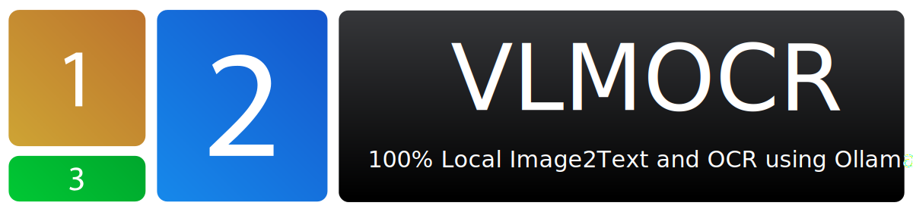

# VLMOCR - Vision Language Model OCR



VLMOCR is a web application that uses Vision Language Models (VLMs) to extract text from images with multi-region selection, providing optical character recognition using modern AI models.


## Features

- **Multi-region OCR**: Select and process different regions of an image independently
- **Text streaming**: View AI-generated text as it's processed
- **Multiple image management**: Upload and switch between images
- **Customizable settings**: Adjust context length, temperature, and seed values
- **Custom prompts**: Tailor the extraction instructions for different content types
- **Adjustable interface**: Resize panels to fit your workflow
- **Cross-device compatibility**: Works on desktop and mobile browsers

## Requirements

- [Node.js](https://nodejs.org/) (v16 or later)
- [Ollama](https://ollama.ai/) - Running locally on your machine
- A Vision-capable language model (such as llama3.1-vision or similar)

## Installation

1. Clone the repository:
   ```bash
   git clone https://github.com/yourusername/VLMOCR.git
   cd VLMOCR
   ```

2. Install dependencies:
   ```bash
   npm install
   ```

3. Make sure Ollama is running locally:
   ```bash
   ollama serve
   ```

4. Pull a vision-capable model:
   ```bash
   ollama pull llama3.1-vision
   ```
   
5. Start the application:
   ```bash
   npm run dev
   ```

6. Open your browser and navigate to [http://localhost:5173](http://localhost:5173)

## Usage

### 1. Upload Images
- Click on the image upload area or drag and drop images
- Select from uploaded images in the image grid

### 2. Configure Settings
- Choose a vision model from the dropdown
- Adjust context length, temperature and seed as needed
- Customize the prompt template for your specific OCR needs

### 3. Select Regions
- Click and drag on the image to select regions
- Click "Save Region" to confirm selection
- Add multiple regions as needed
- Each region will be processed separately

### 4. Generate Text
- Click the "Generate" button to start text extraction
- Watch as text appears in real-time
- Results will be color-coded by region
- Export or clear results as needed

## Example Use Cases

- **Document Processing**: Extract text from scanned documents with complex layouts
- **Multi-column Text**: Process columns separately
- **Mixed Content**: Extract text from images containing text and graphics
- **Tables and Forms**: Process table cells as separate regions

## Technical Details

VLMOCR uses:

- **React + TypeScript**: Frontend implementation
- **Material UI**: Interface components
- **react-image-crop**: Region selection
- **Ollama.js**: Ollama API integration
- **Vite**: Development and build system

The application communicates with locally running Ollama models to process images. All image processing happens in your browser, keeping your images on your device.

## Development

### Project Structure

```
VLMOCR/
├── src/
│   ├── components/     # React components
│   ├── services/       # API and service integrations
│   ├── App.tsx         # Main application component
│   ├── theme.ts        # UI theme configuration
│   └── main.tsx        # Application entry point
├── public/             # Static assets
├── index.html          # HTML entry point
├── package.json        # Dependencies and scripts
└── vite.config.ts      # Build configuration
```

### Building for Production

```bash
npm run build
```

## Roadmap

- [ ] PDF document support
- [ ] Batch processing of multiple images
- [ ] Save and restore sessions
- [ ] Additional model integrations
- [ ] Custom region labeling
- [ ] Advanced image preprocessing options

## License

This project is licensed under the MIT License - see the LICENSE file for details.

## Acknowledgments

- [Ollama](https://ollama.ai/) for providing the backend AI capabilities
- The React and TypeScript communities for excellent tools and libraries

---

*VLMOCR is a user interface for Ollama vision models and is not affiliated with Ollama or any language model providers.*
