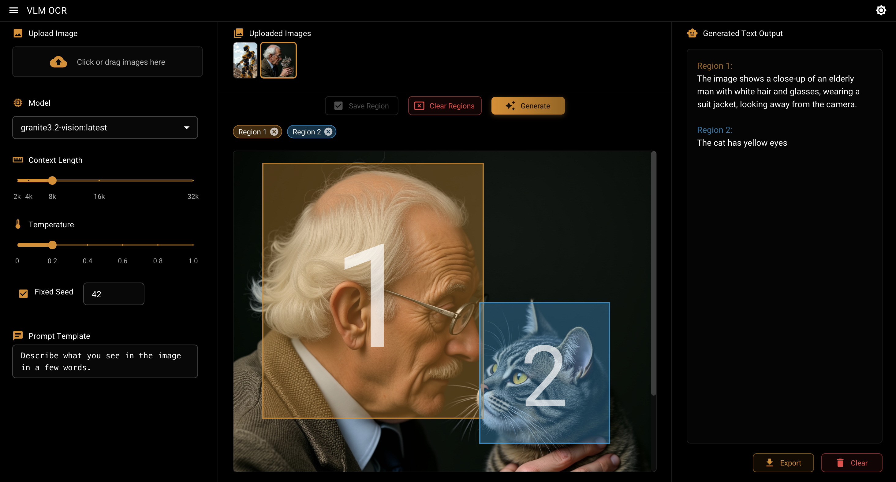

# VLMOCR - Vision Language Model OCR


VLMOCR is a web application that uses Vision Language Models (VLMs) to extract text from images with multi-region selection. While it can be used for OCR, it's a general-purpose image-to-text tool that allows you to send image patches to a model alongside a custom prompt to generate any type of output.

**[Try the live demo here](https://neovand.github.io/VLMOCR/)**



## Features

- **Multi-region processing**: Select and process different regions of an image independently
- **Text streaming**: View AI-generated text as it's processed
- **Multiple image management**: Upload and switch between images
- **Customizable settings**: Adjust context length, temperature, and seed values
- **Custom prompts**: Tailor the instructions for different tasks (OCR, description, analysis, etc.)
- **Adjustable interface**: Resize panels to fit your workflow
- **Completely local**: Your images never leave your device - all processing happens locally
- **Cross-device compatibility**: Works on desktop and mobile browsers

## Requirements

- [Node.js](https://nodejs.org/) (v16 or later)
- [Ollama](https://ollama.ai/) - Running locally on your machine
- A Vision-capable language model (such as gemma3 or granite3.2-vision or similar)

## Installation

1. Clone the repository:
   ```bash
   git clone https://github.com/neovand/VLMOCR.git
   cd VLMOCR
   ```

2. Install dependencies:
   ```bash
   npm install
   ```

3. Make sure Ollama is running locally:
   ```bash
   ollama serve
   ```

4. Pull a vision-capable model:
   ```bash
   ollama pull granite3.2-vision
   ```
   
5. Start the application:
   ```bash
   npm run dev
   ```

6. Open your browser and navigate to [http://localhost:5173](http://localhost:5173)

## Usage

### 1. Upload Images
- Click on the image upload area or drag and drop images
- Select from uploaded images in the image grid

### 2. Configure Settings
- Choose any Ollama model from the dropdown
- Adjust context length, temperature and seed as needed
- Customize the prompt template for your specific task:
  - OCR: "Extract all visible text from this image..."
  - Description: "Describe what you see in this image in detail..."
  - Analysis: "Analyze the components visible in this image..."

### 3. Select Regions
- Click and drag on the image to select regions
- Click "Save Region" to confirm selection
- Add multiple regions as needed
- Each region will be processed separately

### 4. Generate Text
- Click the "Generate" button to start text generation
- Watch as text appears in real-time
- Results will be color-coded by region
- Export or clear results as needed

## Example Use Cases

- **Document Processing**: Extract text from scanned documents with complex layouts
- **Multi-column Text**: Process columns separately
- **Mixed Content**: Extract text from images containing text and graphics
- **Tables and Forms**: Process table cells as separate regions
- **Image Analysis**: Describe or analyze specific parts of an image

## Technical Details

VLMOCR uses:

- **React + TypeScript**: Frontend implementation
- **Material UI**: Interface components
- **react-image-crop**: Region selection
- **Ollama.js**: Ollama API integration
- **Vite**: Development and build system

The application communicates with locally running Ollama models to process images. **All processing happens in your browser, and your images never leave your device**, providing complete privacy and security.

### Building for Production

```bash
npm run build
```

## TODO
- [ ] async generation job adding and stopping

*VLMOCR is a user interface for Ollama vision models and is not affiliated with Ollama or any language model providers.*
